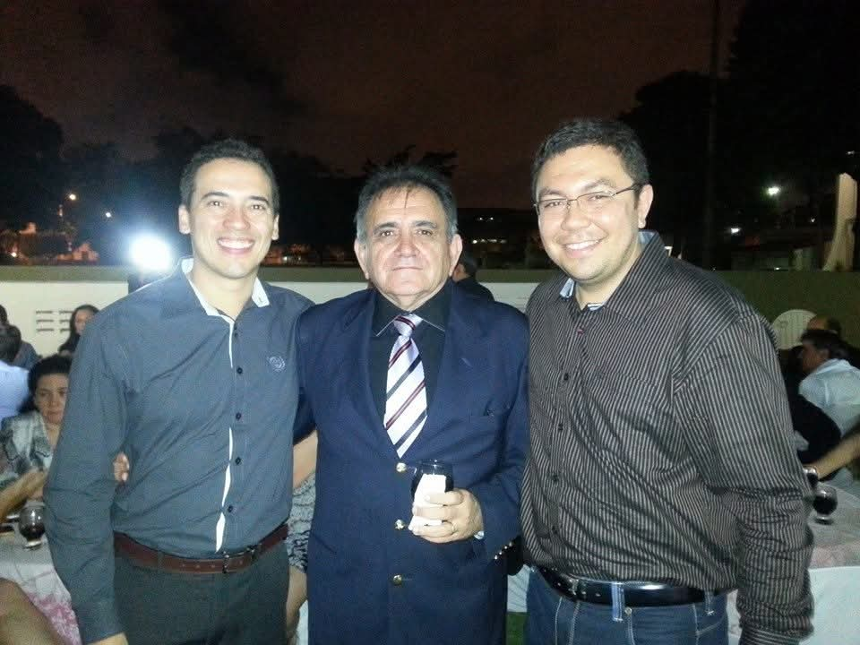
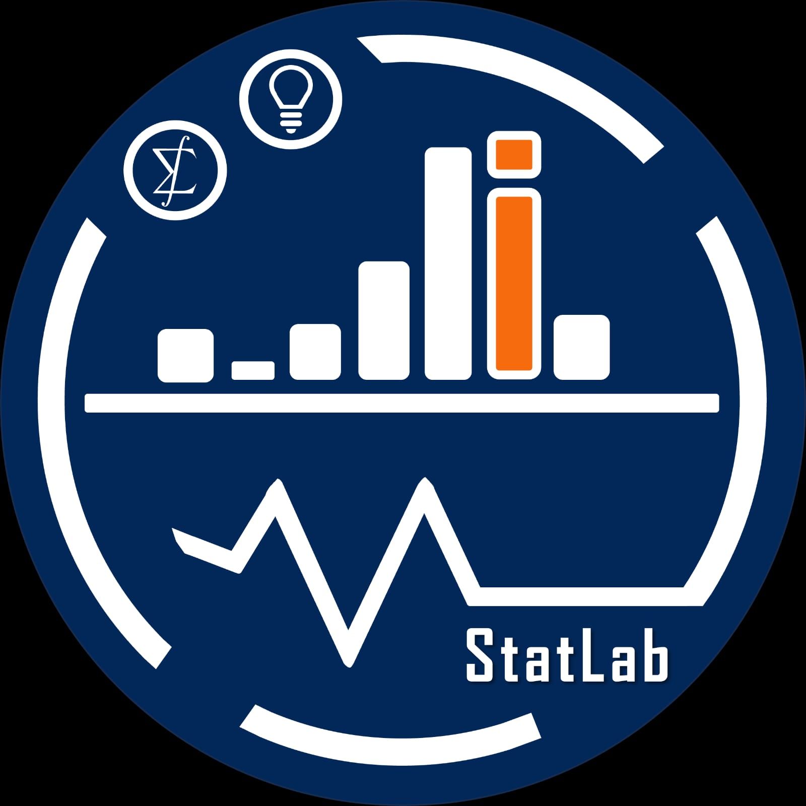

  
# Rapadura Estocástica 

  
## Rapadura Estocástica
  
### Uma história de perseverança e sucesso

::: {.columns}

:::: {.column width="55%"}

- Um mestre
- Várias histórias
- Muitas lutas 
- Várias Conquistas

::::
  
:::: {.column width="45%"}

{.full-image}

::::
  
:::
  
  
## Tudo começou com uma ideia
  
::: {.fragment .fade-in}

Criar um ambiente e uma mentalidade voltados para o desenvolvimento e evolução da Estatística e Ciência de Dados no Estado do Ceará

:::
  
---
  
## 2023
  
# O COMEÇO
  
::: {.columns}

:::: {.column width="55%"}

### Pequenas reuniões

### Grandes Sonhos

- Primeiros integrantes
- Construção da identidade
- Projetos iniciais
- Estatística fora da sala de aula

::::
  
:::: {.column width="45%"}

{.full-image}

::::
  
:::
  
---
  
## Nem tudo é tão simples!
  
# QUANDO EXISTE AMOR E DEDICAÇÃO, TUDO ACONTECE NO TEMPO CERTO!
  
---

# APRESENTAÇÕES ESPECIAIS

## Prof. Dra. Alessandra Cristina da Silva Farias

### Estatística Pesqueira e Ensino da Estatística

 

🔗 [Clique aqui para acessar os slides](https://drive.google.com/file/d/1c9rsigS6UHg40LWJTB8iwU0xn0rOOavp/view?usp=sharing)

---

## Prof. Dr. Ronald Targino Nojosa

### Modelos de Regressão e Estatística Computacional

 

🔗 [Clique aqui para acessar os slides](https://drive.google.com/file/d/1c9rsigS6UHg40LWJTB8iwU0xn0rOOavp/view?usp=sharing)

---

## Prof. Dr. José Roberto Silva dos Santos

### Modelos Bayesianos e Avaliação Educacional

 

🔗 [Clique aqui para acessar os slides](https://drive.google.com/file/d/1c9rsigS6UHg40LWJTB8iwU0xn0rOOavp/view?usp=sharing)

---

# QUEM SOMOS HOJE

## Membros Atuais

::: {.columns}

:::: {.column width="33%"}

### Analytics

**Jose Ailton Alencar Andrade**  
Métodos Bayesianos • Processos Estocásticos

 

**Jose Roberto Silva dos Santos**  
Modelos Bayesianos • Avaliação Educacional

 

**Manoel Ferreira dos Santos Neto**  
Modelos de Regressão • Sobrevivência

 

**Ronald Targino Nojosa**  
Regressão • Estatística Computacional

::::

:::: {.column width="33%"}

### Impacto Social

**Alessandra Cristina da Silva Farias**  
Estatística Pesqueira • Ensino da Estatística

 

**Maria Jacqueline Batista**  
Análise de Dados • Regressão Aplicada

 

**Rafael Braz Azevedo Farias**  
Modelagem Estatística • Avaliação Educacional

::::

:::: {.column width="33%"}

### Aprendizado Estatístico

**Juvêncio Santos Nobre**  
Modelos de Regressão • Avaliação Educacional

 

**Luis Gustavo Bastos Pinho**  
Probabilidade • Processos Estocásticos

::::

:::

---

# Juvêncio Santos Nobre {background-image="images/cabecas.jpeg" background-size="cover"}

## Breve Resumo Profissional

- Membro Permanente do Programa de Pós-Graduação em Modelagem e Métodos Quantitativos

- Bolsista de Produtividade do CNPq

- Editor Associado do *Brazilian Journal of Probability and Statistics*

- 46 aceitos, sendo 26 (56,5%) no estrato A, 16 no B (34,8%), 2 no C (4,3%) e 2 (4,3%)

- 1257 citações

- indice h=16 e i10=24

- Coordenador do projeto Universal/CNPq recentemente aprovado no comitê de Probabilidade e Estatística (2025-2028): Modelos de Regressão e Extensões

---

# O QUE ESTAMOS FAZENDO

## Projetos Ativos

::: {.incremental}

### Extensão 
- Laboratório de Inovação em Estatística (2 bolsistas, 15 agentes de extensão)
- Cultura de Dados e Extensão Universitária: integrando formação acadêmica e impacto social (2 bolsistas, 15 agentes de extensão)

### Ensino
- Storytelling com Dados com Auxílio de IAs
- Além das fórmulas: você utiliza o pensamento estatístico?

### Pesquisa

- Modelagem integrada na dinâmica populacional de Panulirus argus e Panulirus laevicauda no Brasil: subsídios para avaliação de estoques e definição de cotas de captura
- Cientista-Chefe da Transformação Digital no Ceará
- Chamada CNPq/MCTI/FNDCT nº 44/2024 — Modelos de Regressão e Extensões

:::

---

# IMPACTO

## Muito além da universidade

::: {.columns}

:::: {.column width="55%"}

- Formação de pesquisadores
- Participação em eventos científicos
- Produção acadêmica
- Projetos aplicados
- Integração entre ensino, pesquisa e extensão
- Fortalecimento da Estatística no Ceará

::::

:::: {.column width="45%"}

{.full-image}

::::

:::

---

# PRÓXIMOS PASSOS

## Futuro Próximo

::: {.fragment .fade-in}

### Nossos planos

- Expansão do laboratório
- Novas linhas de pesquisa
- Consolidação de parcerias nacionais
- Participação em competições e eventos
- Desenvolvimento de produtos em Ciência de Dados
- Formação de novos talentos
- Maior presença digital e científica

:::

---

# O FUTURO JÁ COMEÇOU

## STATLAB

### Ciência, inovação e transformação através da Estatística e Ciência de Dados

::: {.fragment .fade-in}

"Grandes ideias começam com pequenos encontros."

:::

---

# OBRIGADO!

## Universidade Federal do Ceará

### STATLAB — Laboratório de Inovação em Estatística